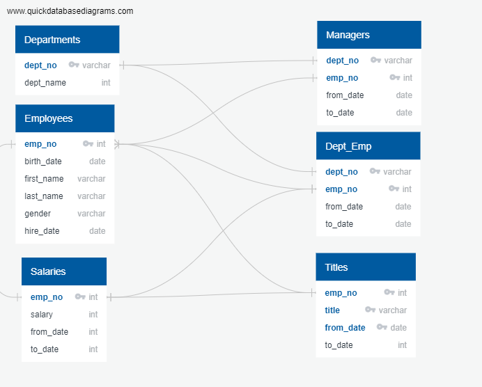
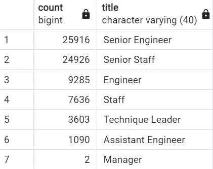
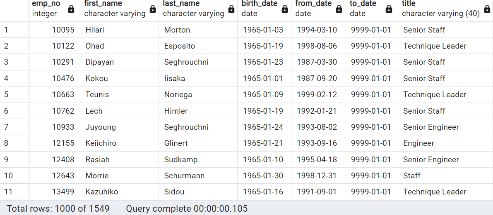
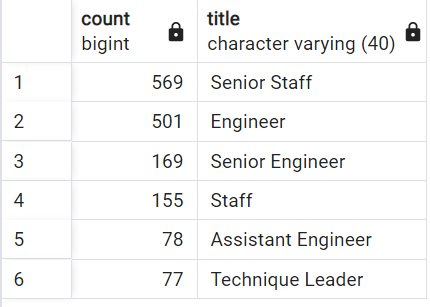

# Pewlett-Hackard-Analysis
## Overview of the Project
In this project we will be playing Bobby to determine the number of retiring employees per title and identify employees who are eligible to participate in a mentorship program and writing a report to summarize the analysis. 6 CSV files are present with 300-400k rows in some files. Each file has to be analyzed and connections between datasets are created in Entity Relationship Diagram which helps in analyzing the data needed for determining the count of retiring employees and those who can be mentors.

## Analysis
* When employee number is used to filter employees who are going to retire, count of 133776 employees was shown.
* Since some employees had more than one title, upon filtering count of 72458 employees was shown who are going to retire.
* 25916 employees with title Senior Engineer, 24926 employees with title senior staff, 9285 employees with title Engineer, 7636 employees under title Staff, 3603 employees with title Technique leader, 1090 employees with title Assistant Engineer and 2 employees who are managers are going to retire.

* 1549 employees who are born between January 1, 1965 and December 31, 1965 are eligible for mentorship.

## Summary
Pewlett Hackard is a large company with several thousand employees. The number of upcoming retirements will leave thousands of job openings. Analyzing the data shows that 72458 employees were going to retire, and 1549 employees are eligible for mentorship. This indicates that they should open positions to recruit more employees and phase out the recruitment as only 1549 employees are eligible to mentor for almost 70k new hires. Another dataset to show how many employees can mentor for each title to see ratio of mentor to new hire. Also, another dataset can be created increasing the employee count for those who can be mentors to reduce the low ratio of mentor to new hire.

